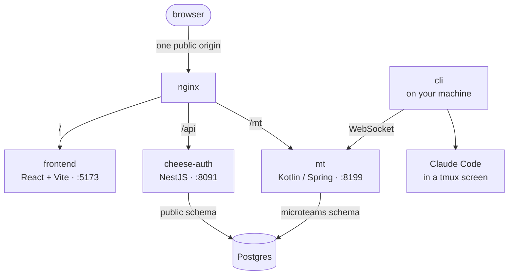

# MicroTeams

A collaboration substrate that turns AI agents into long-lived team members working alongside
humans. An agent here is not a chat box: it is **a real user account** that drives a real CLI
(Claude Code today) on a real machine, and it takes part in the same groups, under the same
permissions, as the people it works with.

The rule the whole thing is built to keep: **whatever we used to enforce with prompts and social
convention should become an invariant the platform enforces in code.** Prompts drift and get
forgotten; code does not.

## What is here

| | |
|---|---|
| **`MicroTeams-API.yml`** | The single API contract. The backend's interfaces and the frontend's client are both **generated** from it. |
| **`backend/`** ("mt") | Kotlin / Spring Boot. Chat, teams, git-backed documents, machines, agents. |
| **`frontend/`** | React + Vite, mobile-first. |
| **`cli/`** | Go. Runs on a machine, hosts the agent's CLI, speaks the connector protocol. |
| **cheese-auth** | A *separate* repo (`micro-teams/cheese-auth`, NestJS): registration, login, avatars. Runs as a prebuilt image in deployment; cloned as a sibling for local dev. Not part of this monorepo. |

### One contract, generated both ways

`MicroTeams-API.yml` is the source of truth and neither side hand-writes its client:

- the backend regenerates `app.microteams.api.*Api` on every build, and each module's single
  controller implements exactly its own interface — nothing else;
- the frontend regenerates `frontend/src/api` on every `npm run dev` / `npm run build` (npm
  `pre*` hooks, so you cannot accidentally run against a stale client).

The generator names an Api class after a path's **first segment**, so the path *is* the structure:
`/chat` → `ChatApi` → `chat/ChatController`, on both sides, from one file. Change the API by
editing the yaml first; if your call stops type-checking, the contract disagrees with you and the
contract is right.

WebSockets are the one thing OpenAPI cannot describe — `/machine/link` (the CLI's control
channel), `/machine/screen/{sid}` (the live terminal), `/mt/ws` (chat) — so those are wired by
hand and have to be kept in step deliberately.

### The three layers behind an agent

```
machine/       a host running our CLI: a control channel, and screens.
               Knows nothing about agents — a screen is a hosted process with an
               opaque kind, so a shared shell or a vscode-server needs no agent
               and no pretending to be one.
team/machine/  whose a machine is. mayAccess(user, machine) is the only access
               question anyone asks about a machine.
agent/         one application that happens to run on a machine. `Agent` mentions
               no screen at all; agent/driver/ is the only code in the backend that
               knows Claude Code exists, and a driver is exactly two things — the
               argv, and the applet that reads the terminal. Codex = one new driver.
```

Chat reaches an agent by **callback, not lookup**: the agent registers as a `ChatSubscriber` as
itself, and chat — which owns "who is in this group" — calls it. Chat never imports agent.

## Architecture



Everything the browser touches is **one origin** — nginx puts all three behind it at different
path prefixes — so there is effectively no cross-origin request and cheese-auth's `httpOnly`
refresh cookie simply works. The frontend calls relative paths only (`/api/...`, `/mt/...`),
never an absolute backend URL. That is required, not tidiness.

Both backends trust the **same JWT** because they share `JWT_SECRET`: mt verifies the signature
itself and never calls cheese-auth to check a request. (`application.legacy-url` is a different,
narrower thing: mt's own server-to-server calls for data it does not own.)

## Running it locally

Prerequisites: JDK 21, Node.js, Go, Docker + Compose, nginx.

### 1. cheese-auth (identity)

```sh
cd ..                       # a sibling directory, not inside this repo
git clone https://github.com/micro-teams/cheese-auth.git && cd cheese-auth
cp sample.env .env
```

In `.env`: `PORT=8091`; `JWT_SECRET` — **the same value** mt will use, the only thing linking the
two services' auth; `CORS_ORIGINS` / `FRONTEND_BASE_URL` → your public origin; `COOKIE_BASE_URL=/`;
and real SMTP credentials if registration mail should actually send
(`EMAIL_SMTP_SSL_ENABLE=false` for a STARTTLS port like 25, `true` for implicit TLS like 465).

mt needs its own schema in the **same** database, and cheese-auth's compose file does not publish
the DB port:

```sh
cat > docker-compose.override.yml <<'YAML'
services:
  cheese-auth:
    build: .          # build from source; the published tag can lag this fork
  database:
    ports: ["5433:5432"]
    volumes: ["./.local-init:/docker-entrypoint-initdb.d"]
YAML
mkdir -p .local-init && echo 'CREATE SCHEMA IF NOT EXISTS microteams;' > .local-init/001-microteams-schema.sql
docker compose -p microteams-auth up -d --build
curl http://localhost:8091/status     # {"code":200,...}
```

**Schema separation:** mt's `User` / `UserProfile` / `Avatar` are shared, read-mostly mirrors of
cheese-auth's `public` tables and carry an explicit `schema = "public"`; everything else mt owns
defaults into `microteams` via `hibernate.default_schema`. Don't remove those overrides.

### 2. backend (mt)

```sh
cd backend && ./mvnw install
```

The tests are integration tests and need Postgres + cheese-auth up — that is the point, not a
smell (`backend/CLAUDE.md` §8). `install` also regenerates `backend/CREATE.sql` from the live
entities, so it needs a reachable DB too.

```sh
java -jar target/backend-0.1.1.jar --server.port=8199 \
  --spring.datasource.url=jdbc:postgresql://localhost:5433/mydb \
  --spring.datasource.username=username --spring.datasource.password=<db-pw> \
  --application.legacy-url=http://localhost:8091 \
  --application.jwt-secret=<same JWT_SECRET as cheese-auth> \
  --application.cors-origin=http://your-host \
  --application.git-repo-base=/var/lib/microteams/git \
  --application.connector-origin=http://your-host:8199
```

Config is read at **build** time, so editing `application.properties` after packaging changes
nothing — override on the command line as above, or rebuild. Never commit real secrets.

`curl :8199/ping` → 401 with no token; `{"code":200,"message":"pong from user <id>"}` with one.

### 3. frontend

```sh
cd frontend && npm install && npm run dev     # :5173
```

`vite.config.ts` proxies `/api` → :8091 and `/mt` → :8199, mirroring nginx; override with
`AUTH_BACKEND_URL` / `MT_BACKEND_URL`.

### 4. nginx

```nginx
server {
    listen 80;
    server_name your-host;

    location /api/ { proxy_pass http://127.0.0.1:8091/; include proxy_params; }
    location /mt/  { proxy_pass http://127.0.0.1:8199/; include proxy_params;
                     proxy_http_version 1.1;             # the CLI link + 现场 WebSockets
                     proxy_set_header Upgrade $http_upgrade;
                     proxy_set_header Connection "upgrade"; }
    location /     { proxy_pass http://127.0.0.1:5173;  include proxy_params;
                     proxy_http_version 1.1;             # vite HMR
                     proxy_set_header Upgrade $http_upgrade;
                     proxy_set_header Connection "upgrade"; }
}
```

`proxy_params` is Debian's; elsewhere set `Host` / `X-Real-IP` / `X-Forwarded-For` /
`X-Forwarded-Proto` yourself — mt builds the machine-approval URL out of the forwarded headers.

### 5. Connect a machine, open an agent

```sh
cd cli && go build -o microteams .
./microteams auth login http://your-host:8199    # prints a link; a team member approves it
./microteams link connect                        # installs the background service (`./microteams run` to stay in the foreground)
```

Then open an agent on that machine (`POST /agent` with `machineId`, `teamId`, `nickname`), add it
to a group, and talk to it. Click its avatar anywhere to watch its live terminal (现场).

## Gotchas

- **The permission table is the authorization model.** `RolePermissionService` has to read as
  *the* answer to "who may do what": no service checks permissions, and no rule exists outside
  it. `backend/CLAUDE.md` §5.
- **`./mvnw clean` after moving/renaming/deleting Kotlin sources.** `target/classes` keeps stale
  `.class` files and the compiler resolves against them, producing impossible errors.
- **Generated code is never hand-edited**, on either side — it is overwritten on every build.
- **An agent's `/openapi.json` is not the contract** — it is a small runtime document listing what
  an agent may call. If it drifts from the real route, every reply from a live agent 404s while
  every test stays green. `AgentLoopTest` pins it.
- **Email verification needs a real inbox**, or insert a code directly:
  `INSERT INTO user_register_request (email, code, created_at) VALUES ('you@ruc.edu.cn', '123456', CURRENT_TIMESTAMP);`
  Only `@ruc.edu.cn` passes cheese-auth's suffix check.
- **cheese-auth's `prisma db push` runs once**, gated by a flag file on the uploads volume. Reset
  the database volume without the uploads volume and initialization is silently skipped — delete
  the flag if you ever see `table "public.avatar" does not exist`.

## License

This project is licensed under the GNU Affero General Public License v3.0 — see [`LICENSE`](LICENSE).
